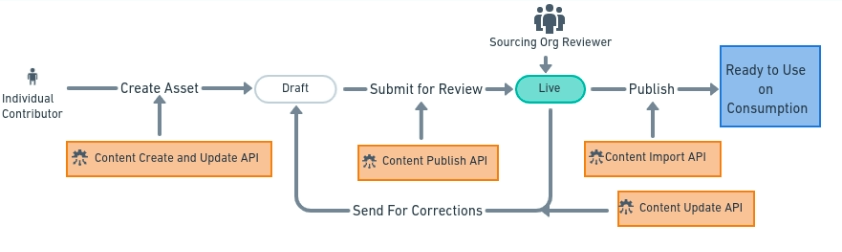
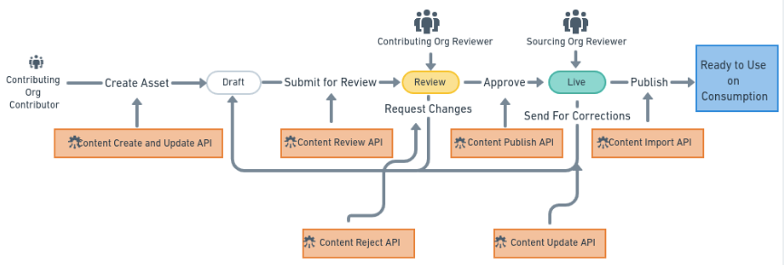

# Lifecycle of contribution of an asset

### For an individual contributor 

Lifecycle of learning assets is a 3 stage cyclic process. Learning Assets follow maker checked method for assets creations.&#x20;

Draft  --> Live --> Publish ( Import on consumption )

The initial stage of asset creation is Draft. In this stage asset creation happens.&#x20;

After the creation, when submitted, asset move to the Live state where the sourcing org reviewer can Publish or Reject or send it back for corrections.

Send for corrections asset move back to the Draft stage. While Publish asset, publish the asset on the Consumption. When sourcing org, Rejects an asset, it just stays in Live state in co-kreat repository.

### For a contributor of contributing org  

Lifecycle of learning assets is a 4 stage cyclic process. Learning Assets follow maker checked method for assets creations.&#x20;

Draft --> Review --> Live  --> Publish __ ( Import on consumption )\

The initial stage of asset creation is Draft. In this stage asset creation happens.&#x20;

After the creation, when submitted, asset move to the Review stage where the contributing org reviewer can Accept or Request changes for an asset

Asset, requested for changes, moves back to Draft Stage, While Accept, moves the Asset to Live state.&#x20;

Sourcing Org reviewer can Publish or Reject or send an asset for corrections.
